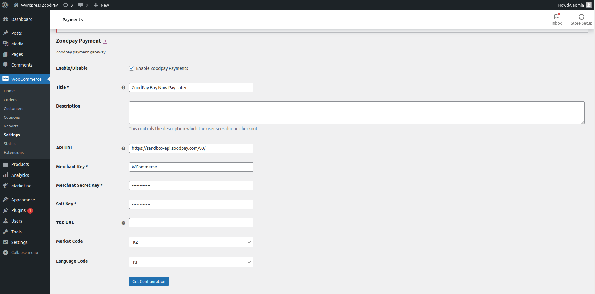

# ZoodPay WooCommerce Payment Plugin
[](LICENSE.md)

ZoodPay Buy Now Pay Later Payment Plugin for WooCommerce

[ZoodPay API Documentation](https://apidocs.zoodpay.com/)

## Installation

```
1. Log in to your website’s WordPress admin.   Ex: your-website.com/wp-admin
```

```
2. In the left sidebar, click Plugins > Add New.
3. Click Upload Plugin.
5. Select Downloaded Archive file. 
4. It will install the ZoodPay Plugin, Verify that Plugin is Activated.
```


## Usage

```
1. In the left sidebar, click WooCommerce > Settings. 
2. Select the Payments tab. 
3. Click the Manage button for ZoodPay.
```

```
4.  Check the Enable/Disable checkbox for enabling ZoodPay.
5.  Set Title for ZoodPay Buy Now Pay Later.
6.  Set Merchant Key as received from the ZoodPay Business Team.
7.  Set Merchant Secret Key as received from the ZoodPay Business Team.
8.  Set Merchant Salt Key as received from the ZoodPay Business Team.
9.  Set API URL as received from the ZoodPay Business Team. 
10. Click on the API HealthCheck, to verify the API HEALTH 
11. Select Market Code Based on your Country.
12. Select Language Code Based on your Preference.
13. Click Save Changes
14. Click Fetch Configuration

```



## Changelog
Please see [CHANGELOG](CHANGELOG.md) for more information what has changed recently.

## Contributing
Please see [CONTRIBUTING](CONTRIBUTING.md) for details.

##Support
For any inquiry write to integration@zoodpay.com with a detailed description of the issue.
## Credits
- [ZoodPay](https://github.com/orientswiss)
## License
The GNU GENERAL PUBLIC LICENSE (GPL). Please see [License File](LICENSE.md) for more information.
